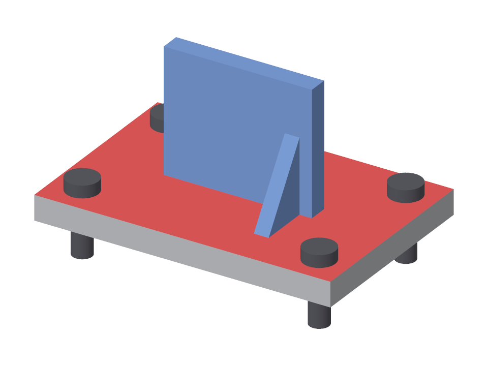
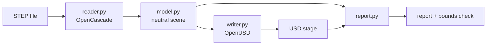

# step2usd

Convert STEP assemblies to OpenUSD without flattening them into a bag of triangles.

A plain mesh export of a CAD model loses most of what made it an engineering
model: which parts exist, what they are called, which forty bolts are really
one bolt, and what anything weighs. `step2usd` reads the STEP file with a CAD
kernel and carries that structure across.



## What survives the conversion

| In the STEP file | In the USD stage |
| --- | --- |
| Assembly tree | `Xform` hierarchy with `assembly` / `group` / `component` kinds |
| Part and assembly names | Prim names, with the original kept as `displayName` when it had to change |
| The same part placed many times | One prototype, referenced by instanceable prims |
| Placement of each occurrence | `xformOp:transform` on the occurrence |
| Part colours and per-face colours | `displayColor`, constant or per triangle |
| Length unit (mm, inch, m...) | Normalised to metres (or millimetres), `metersPerUnit` set to match |
| Exact solid volume and centre of mass | `UsdPhysics.MassAPI` mass and `centerOfMass`, given a density |
| B-rep face identity (optional) | `primvars:cadFaceId`, one face index per triangle |

Curved surfaces are tessellated to a tolerance you choose. Normals come from
the underlying surfaces, so cylinders shade smoothly and edges stay crisp.

## Quick start

Windows:

```bat
python -m venv .venv
.venv\Scripts\activate
python -m pip install -e ".[dev]"
python -m pytest -q
```

macOS / Linux:

```bash
python3 -m venv .venv
source .venv/bin/activate
python -m pip install -e ".[dev]"
python -m pytest -q
```

Look at a file, then convert it:

```console
$ step2usd inspect examples/bracket_assembly.step
Bracket Assembly/
  Base Plate (rev B)  [10 faces]
  M8 Bolt  [5 faces, 1 of 4]
  M8 Bolt  [5 faces, 1 of 4]
  M8 Bolt  [5 faces, 1 of 4]
  M8 Bolt  [5 faces, 1 of 4]
  Upright Assy/
    Upright  [6 faces]
    Rib  [5 faces, 1 of 2]
    Rib  [5 faces, 1 of 2]

$ step2usd convert examples/bracket_assembly.step -o out/bracket.usda --density 7850 --report out/report.json
bracket_assembly.step -> bracket.usda  (m, Z up)
  2 assemblies, 8 placed parts from 4 unique parts (6 instanced)
  668 triangles stored, 1288 once instances are placed
  volume 128.74 cm^3, mass 1.011 kg
  bounds match the CAD model within 2.68e-09 m
  8 names adjusted to valid prim names (originals kept as displayName)
```

## Options

| Flag | Default | Meaning |
| --- | --- | --- |
| `--units m\|mm` | `m` | Stage units. Geometry is rescaled, not just relabelled. |
| `--up-axis Z\|Y` | `Z` | `Z` matches CAD and robotics tools; `Y` turns the model for DCC tools. |
| `--linear-deflection MM` | `0.1` | Largest gap allowed between a surface and its triangles. |
| `--angular-deflection RAD` | `0.5` | Largest angle allowed between neighbouring triangles. |
| `--density KG_M3` | off | Author colliders, a rigid body on the root, and exact masses. |
| `--no-instancing` | off | Write every placement as its own mesh. |
| `--face-ids` | off | Keep each triangle's CAD face index as a primvar. |
| `--report PATH` | off | Write the JSON report. |

## How it works



- **`reader.py`** opens the file as a structured CAD document, walks the
  product tree, tessellates each unique part once, and asks the kernel for the
  exact volume, centre of mass and bounding box.
- **`model.py`** is a small neutral scene (nodes, parts, meshes) that imports
  neither library. Swapping the input format or the output format touches one side.
- **`writer.py`** authors the stage. A part used once is written in place; a
  part used more than once goes under `/_Prototypes` and is referenced.
- **`report.py`** checks the result: USD computes the stage's bounding box
  from what was written, and it must match the box the CAD kernel computed from
  the B-rep. A wrong unit scale, a transposed matrix or a lost placement fails
  the check, and the command exits non-zero.

## Stage layout

```
/Bracket_Assembly              Xform, defaultPrim, kind = assembly
  /Base_Plate_rev_B            Xform, kind = component
    /Mesh
  /M8_Bolt, /M8_Bolt_1, ...    instanceable references to /_Prototypes/M8_Bolt
  /Upright_Assy                Xform, kind = group
    /Upright/Mesh
    /Rib, /Rib_1               instanceable references to /_Prototypes/Rib
/_Prototypes                   class prim: not drawn, not traversed
  /M8_Bolt/Mesh
  /Rib/Mesh
```

## Isaac Sim example

`examples/isaac_drop_test.py` takes a converted assembly into NVIDIA Isaac Sim
and checks the simulation against the CAD model:

```bat
step2usd convert examples\bracket_assembly.step -o out\bracket.usda --density 7850
C:\isaacsim\python.bat examples\isaac_drop_test.py out\bracket.usda
```

It builds a small scene around the asset (ground, gravity, lights, camera),
opens it in Isaac Sim, drops the part from 10 cm and waits for it to come to
rest. Then it compares three things with what the CAD model implies:

| Check | Simulator says | CAD says |
| --- | --- | --- |
| Mass | PhysX's computed mass for the rigid body | density x exact B-rep volume |
| Rest height | where the part's origin ends up | distance from origin to its lowest point |
| Tilt | how far it leans once at rest | zero, for a part that lands flat |

A mass mismatch means the colliders or masses did not survive the trip into
the simulator, which is exactly what a CAD-to-sim pipeline needs to catch. It
also saves a rendered image and a JSON result next to the asset.

Run it with Isaac Sim's own Python, not the project environment. Add `--gui`
to watch, or `--build-only` to write just the scene and open it by hand
(File > Open, then Play).

## Tests

The tests run against a generated assembly (`examples/make_sample.py`) whose
dimensions are known, so results are compared with hand-calculated values:
part volumes, masses, the centre of mass, where a rotated nested part lands,
and which triangles carry the painted face's colour. The tessellation is
checked for closedness and outward winding with the divergence theorem.

## Status and limits

Tested with `cadquery-ocp` 8.0 and `usd-core` 26.8 on Python 3.13.

- So far it has only been run on the generated sample. Real-world STEP files
  (large assemblies, surface bodies, odd exporters) are the next thing to try.
- The output has been checked through the USD API and the preview rasteriser,
  not yet opened in usdview or Omniverse.
- The Isaac Sim example's scene-building half is covered by tests. The simulation
  half has not been run yet, so expect to adjust it on first contact with Isaac Sim.
- Mesh extraction loops over vertices in Python, so very large models will be slow.
- Colours become `displayColor` only; there are no materials.
- Colliders use a convex hull per part, which fills in holes and pockets.
- Not carried over: PMI and tolerances, layers, joints or mates, curves and points.

## Next steps

- [ ] Run on public STEP files (for example the NIST CAD test cases) and fix what breaks
- [ ] Run `examples/isaac_drop_test.py` in Isaac Sim and add its image here
- [ ] UsdPreviewSurface materials from CAD colours
- [ ] Vectorise mesh extraction
- [ ] Convex decomposition option for concave parts
